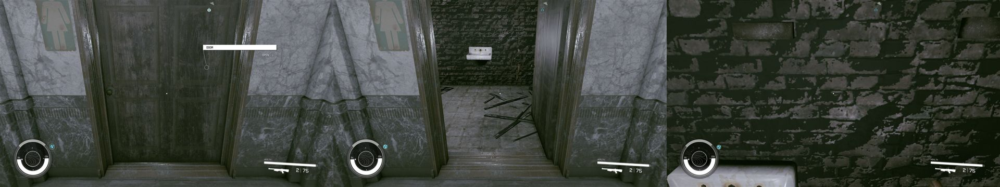
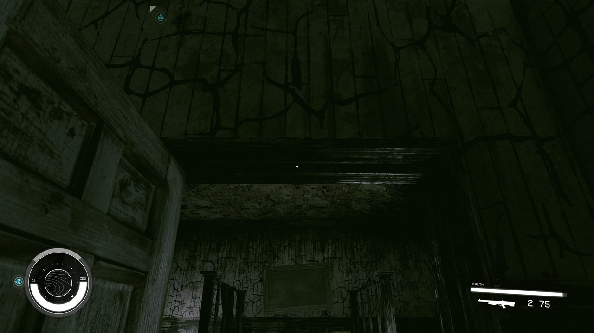
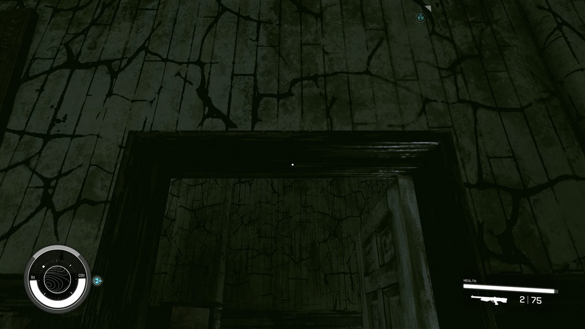

# Fallout 4 → Starfield: a measured conversion toolchain

**An experimental, unofficial research and converter project for carrying Fallout 4 content into Starfield (Creation Engine 2).** It reads game files from installations you select and generates local outputs. The repository contains no raw Bethesda game data or extracted assets; it does include a small set of in-game screenshots depicting Bethesda-owned visuals, which are not covered by this repository's code license. This is a work in progress, not a playable total conversion.

[Issues](https://github.com/dasscooby/fo4-to-starfield/issues) · [Current project status](https://github.com/dasscooby/fo4-to-starfield/issues/32) · [Work packages](docs/WORK-PACKAGES.md) · [Format research](docs/FORMAT-GAP.md)

[](https://github.com/dasscooby/fo4-to-starfield/actions/workflows/ci.yml)

## What is working

A Fallout 4 patio chair has rendered inside Starfield with its shape, scale, original texture, lighting, shadows, and converted box collision. Experimental interior builds also load in Starfield. The latest pinned route report shows real progress and remaining failures; it does **not** establish that the interior milestone is complete.

### Recent in-game route results

Reported by Claude on 2026-10-10 for one pinned test build (code `1d3d5bf`; details and limitations in [shared status #32](https://github.com/dasscooby/fo4-to-starfield/issues/32)):

| Test area | Result |
|---|---|
| Vault 111 | 12/12 routes passed, including stairs and a switch door from both sides |
| Parsons | 11 hinged doors passed from both sides with an `OPEN` prompt recorded |
| Vault 114 | 28 routes passed; three doors still failed on both sides and three passed on one side only |
| Hotel Rexford | 28 routes passed; one door failed on both sides and three passed on one side only |
| Prydwen | Partial run: 11 passes, 7 falls, and 14 unread results among 33 reported attempts (one attempt is unclassified in the status summary) |
| Vault 81 and Boston Public Library | Not yet run on that pinned route build |

These are reports for a particular build, not a guarantee about other builds or a finished conversion. Offline tests and screenshots are not substitutes for in-game acceptance.

### See the work

**A converted object in Starfield**


**Interiors and routes**








More captured work: [Vault 111](docs/spikes/WP10-vault111-first-light.md) · [additional interiors](docs/spikes/WP10-more-interiors.md) · [collision](docs/spikes/S6-collision.md) · [door routes and test evidence](https://github.com/dasscooby/fo4-to-starfield/issues/32).

## What remains

The current priority is finishing a measured interior slice: stairs and openings that preserve walkable collision, doors that work from both sides, and repeatable deployment. Open problems include Prydwen stair falls, some blocked or one-sided doors, and Fallout 4 physics objects that still behave as fixed obstacles in Starfield. See [the issue tracker](https://github.com/dasscooby/fo4-to-starfield/issues) and [risk register](docs/RISKS.md) for current work. Actors, terrain, quests, animation systems, and full-game parity are not complete.

## Why conversion is difficult

| Format area | Fallout 4 | Starfield |
|---|---|---|
| Plugin form version | 131 | 581 |
| Shared record fields | Sampled overlap is mostly 25–60% | Different record model and fields |
| Terrain | 37,020 `LAND` records in the measured sample | `.btd` terrain and procedural planets |
| Meshes | NIF geometry | NIF metadata plus external `.mesh` geometry |
| Materials | `.bgsm` / `.bgem` | JSON `.mat`, compiled into `.cdb` |
| Collision | Havok 2014 packfile | Havok tagfile and `hknp` shapes |

These are measured research notes, not promises of complete format support. Methods and sources: [format gap](docs/FORMAT-GAP.md), [spikes](docs/spikes/), and [measurement scripts](scripts/).

## Try it

```powershell
git clone https://github.com/dasscooby/fo4-to-starfield
cd fo4-to-starfield
python -m pip install -r requirements-ci.txt
python -m unittest discover -s tests -v
python scripts/guard.py
```

To reproduce measurements, install the tools listed in [setup](docs/SETUP.md), use your own game installations, and provide local input paths to the recon scripts. Keep generated data and converted assets outside this repository. Read [contributing](CONTRIBUTING.md) before opening a pull request.

## Safety and project rules

- **No raw game assets or extracted files in Git or releases.** Do not submit `.esm`, `.ba2`, `.nif`, `.dds`, `.mesh`, `.hkx`, audio, executables, or converted outputs. The repository currently includes a limited set of screenshots captured in-game; these depict third-party visuals, are excluded from the MIT grant, and do not establish permission for reuse. The guard and CI check for raw assets and local paths.
- Converters read local files selected by the user; generated outputs stay local. The project does not distribute a conversion pack.
- Tests use synthetic fixtures. Offline passes do not prove that an asset works in-game.
- This is for offline, single-player modding research. It does not modify either game's executable.
- Do not commit credentials, personal machine paths, or private game data. Report suspected vulnerabilities using [GitHub's private reporting option](https://github.com/dasscooby/fo4-to-starfield/security/advisories/new) when available; see [SECURITY.md](SECURITY.md).

## Legal and license

This repository is unofficial and is not affiliated with or endorsed by Bethesda Softworks or ZeniMax Media. Fallout, Starfield, Creation Engine, and related names and materials belong to their respective owners. **The MIT license in this repository applies only to original project code and documentation; it does not grant rights to Bethesda software, game assets, trademarks, screenshots, or user-generated outputs.**

The project does not provide legal advice or establish that any particular extraction, conversion, or use is permitted. Check the current [Bethesda Terms of Service](https://bethesda.net/data/tos/en.html), the applicable [game EULA](https://bethesda.net/data/eula/en.html), and laws where you live; seek qualified legal advice if you need a determination for your circumstances. Avoid uploading or sharing game-derived outputs unless you have confirmed you have the necessary rights.

## Contributing and attribution

Read [CONTRIBUTING.md](CONTRIBUTING.md), choose an open issue, and use its acceptance criteria. Every change must pass the synthetic tests and asset guard. Identify whether a result is **in-game verified**, **offline tested**, or an **unverified hypothesis**.

The project is led by **dasscooby**. AI-assisted contributions are acknowledged by role: **Claude** (conversion pipeline and in-game testing), **Codex** (deployment, recovery, persistent identities, and output verification), and **Grok** (acceptance criteria and evidence gates). Agent labels and commit subjects identify work; these names do not represent separate human contributors or endorsements.
