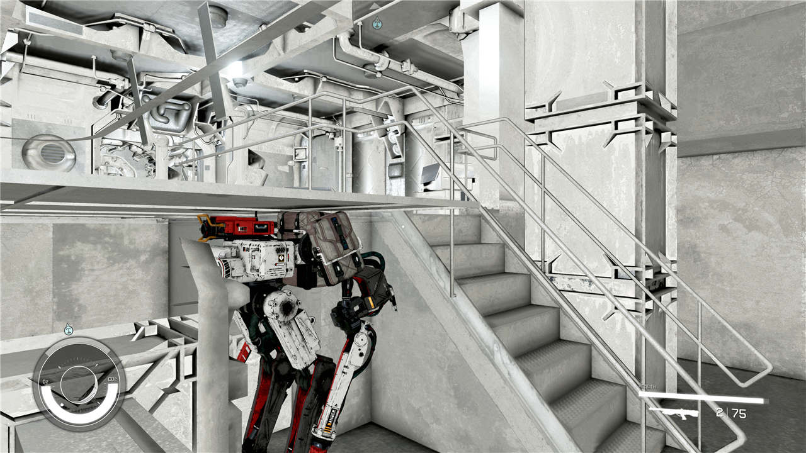
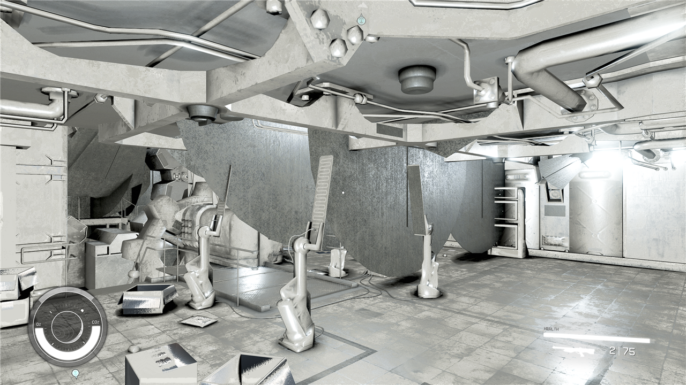
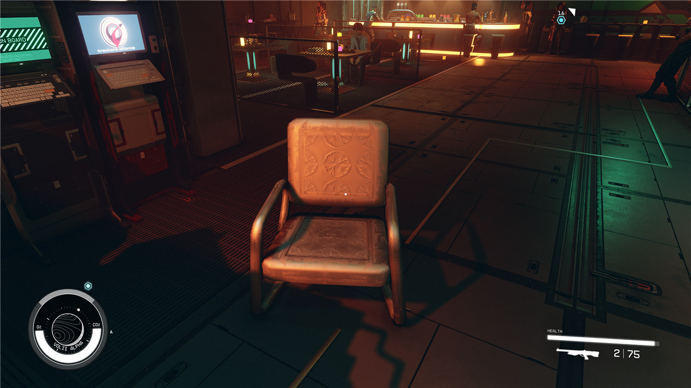

# fo4-to-starfield

**Research and toolchain for porting Fallout 4 to Starfield's engine (Creation Engine 2).**
Format notes, measurements, a risk-first plan, and (as they land) converters for meshes, materials,
collision, plugin records, terrain and more. Converts from **your own** game copies; no game assets are
included or distributed.

> **Status: a Fallout 4 prop renders in Starfield.** A Fallout 4 chair, converted by this toolchain and loaded as a
> plugin, was spawned in the running game (Starfield 1.16.244): correct shape, size and orientation, lit and
> shadowed by the scene ([screenshot](docs/media/fo4-chair-in-starfield.png), write-ups: [S1](docs/spikes/S1-mesh-writer.md),
> [S2/S4/S9](docs/spikes/S2-S4-S9-plugin-units-loading.md)), now with its **original Fallout 4 texture**
> converted to Starfield's material format ([S3](docs/spikes/S3-materials.md)). It now has **box collision** (solid and fixed in place, [S6](docs/spikes/S6-collision.md)); plugin records beyond a static, terrain, actors and animation are still to do.
> See [Work packages](docs/WORK-PACKAGES.md).

**Newest: Fallout 4's Vault 111 interior loads in Starfield as a walk-in cell** (layout, models, textures; lighting still rough):
[write-up](docs/spikes/WP10-vault111-first-light.md).







If you landed here searching for *"Fallout 4 in Starfield"*, *"convert Fallout 4 NIF to Starfield"*,
*"Starfield .mesh format"*, *"what replaced LAND in Starfield"* or *"port Fallout 4 mods to Starfield"*:
the answers we have so far are in [docs/FORMAT-GAP.md](docs/FORMAT-GAP.md) and [docs/RISKS.md](docs/RISKS.md).

## Why this is hard (measured, not guessed)

| | Fallout 4 (Creation Engine 1) | Starfield (Creation Engine 2) |
|---|---|---|
| Plugin form version | 131 | 581 |
| Record types | 137 (116 shared) | 180 |
| Sampled field overlap on shared types | | mostly 25–60% (`STAT` 0.23, `WEAP` 0.30, `NPC_` 0.51) |
| Terrain | 37,020 `LAND` records | **none**; `.btd` files + procedural planets |
| NIF mesh | BS 130, geometry inline | BS 173 (base game) / 175 (DLC), geometry in external `.mesh` files (~684k of them) |
| Materials | 7,077 `.bgsm` + 295 `.bgem` | `.mat` JSON, compiled into one `.cdb` |
| Collision | Havok 2014 packfile | Havok tagfile, `hknp` shapes |
| Animation | 15.7k `.hkx` | `.af`/`.afx`/`.agx`/`.rig` |
| Voice | 123k `.fuz` | Wwise `.wem` + FaceFX `.ffxanim` |

Details and sources: [docs/FORMAT-GAP.md](docs/FORMAT-GAP.md).

## Approach in one paragraph

A deterministic, resumable **conversion pipeline**, not a hand rebuild: Fallout 4 data → open intermediate
formats (glTF, PNG/DDS, JSON) → Starfield formats, run by anyone on their own installs, verified by
machine oracles at every step (parser round-trip → NifSkope/xEdit → Creation Kit → in-game screenshot),
with fidelity tiers so the build always completes. It starts with spikes that kill or confirm the
riskiest assumptions, then the order is **item → static → interior (Vault 111) → actor → exterior**.
Full reasoning: [docs/PLAN.md](docs/PLAN.md).

## Repo map

| Path | What |
|---|---|
| [docs/PLAN.md](docs/PLAN.md) | Strategy, architecture, phases, verification ladder |
| [docs/RISKS.md](docs/RISKS.md) | Risk register and the nine spikes (S1–S9) with go/no-go and fallbacks |
| [docs/WORK-PACKAGES.md](docs/WORK-PACKAGES.md) | The task list; mirrored as GitHub issues |
| [docs/FORMAT-GAP.md](docs/FORMAT-GAP.md) | Measured differences between the two games |
| [docs/SETUP.md](docs/SETUP.md) | Tools and pinned versions |
| [docs/spikes/S1-mesh-writer.md](docs/spikes/S1-mesh-writer.md) | First result: the `.mesh` / NIF format, solved offline |
| [src/fo4sf/](src/fo4sf/) | `sfmesh` (.mesh read/write), `nif` (container), `sfnif` (Starfield blocks), `convert_static` |
| [docs/JOURNAL.md](docs/JOURNAL.md) | Evidence journal: every experiment, newest last |
| [docs/measurements/](docs/measurements/) | Raw JSON from the recon scripts (counts only, no game content) |
| [scripts/](scripts/) | `recon.py`, `recon_physics.py`, `guard.py`, `render_preview.py`, [`oracles/`](scripts/oracles/) (the checks behind S1) |

## Quick start (contributors)

```
git clone https://github.com/dasscooby/fo4-to-starfield
cd fo4-to-starfield
python -m unittest discover tests        # synthetic fixtures only
python scripts/guard.py                   # must pass before every commit
```
Then read [docs/SETUP.md](docs/SETUP.md) and pick a work package marked `ready`.

To reproduce the measurements on your own installs:
```
python -I scripts/recon.py --fo4-esm <Fallout4.esm> --fo4-data <FO4 Data dir> --sf-data <Starfield Data dir> --out out/
```

## Rules of the repo

- **No game data, ever.** No `.esm`, `.ba2`, `.nif`, `.dds`, `.mesh`, `.hkx`, `.wem`, executables, or
  anything derived from them beyond statistics. `scripts/guard.py` enforces it (a GitHub Actions template is in [`ci/`](ci/), not enabled yet).
- Converters read your copies of the games; output stays on your machine.
- Offline / single-player only.
- AI-assisted: this project was started with AI coding assistance. Contributions of any kind are welcome;
  please say if yours was AI-assisted.

## Related projects

- [fo76utils/nifskope](https://github.com/fo76utils/nifskope): NifSkope fork with Starfield `.mesh` / `.mat` support
- [Mutagen](https://github.com/Mutagen-Modding/Mutagen): .NET library with Fallout 4 and Starfield record support
- [PyNifly](https://github.com/BadDogSkyrim/PyNifly): Blender NIF import/export (Fallout 4)
- [xEdit](https://github.com/TES5Edit/TES5Edit): plugin editor (`xSFEdit`, `xFOEdit`)
- [CoACD (fo76utils fork)](https://github.com/fo76utils/CoACD): convex decomposition for collision
- [SFSE](https://sfse.silverlock.org/): Starfield Script Extender

## Legal

Fallout, Starfield and Creation Engine are trademarks of Bethesda Softworks / ZeniMax Media. This project is
unofficial and unaffiliated. It contains no Bethesda content. You need legitimate copies of both games.
Licence: [MIT](LICENSE) (code and documentation).
